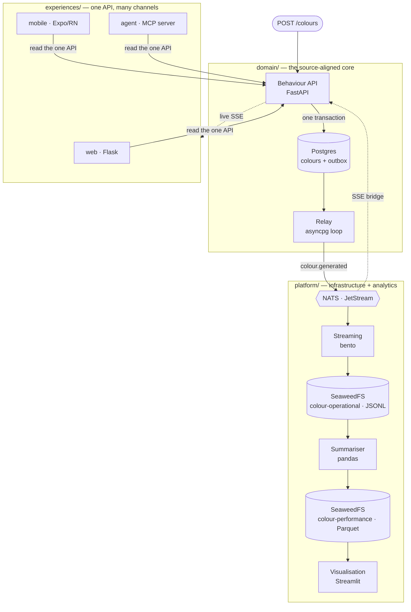

# outcome-app-pattern

A reference demonstrator for a **source-aligned, API-first, multichannel domain**.

One place owns the behaviour (the API), the operational state, the data contract, and
the events. Multiple experiences — **web, mobile, and agent** — consume that *same*
contract instead of reimplementing logic. The trivial "generate a colour" example keeps
the **pattern** in focus, not the feature.

## The pattern



The logical pattern and the same diagram for other platforms live in
[docs/architecture](docs/architecture/index.md).

- **`domain/`** — the one owner of behaviour. `POST /colours` writes the operational row and a
  transactional **outbox** row in one transaction; the **relay** ships the outbox to NATS. All
  three contracts (OpenAPI, AsyncAPI, data) and the event schema live here too.
- **`experiences/`** — three channels, zero shared code, all consuming the same API + event
  feed: `web` (Flask), `mobile` (Expo/React Native), `agent` (MCP server).
- **`platform/`** — bento streams events to object storage; the **summariser** rolls the raw
  stream up into a curated daily aggregate; analytics read the products back.

Everything runs locally and in isolation via `docker-compose.yml`, with no proprietary
dependencies. Full detail is in [docs/architecture](docs/architecture/index.md).

## Quickstart

```bash
task up          # build + start the whole stack
```

Then click **Generate** in the web UI (http://localhost:5001) or `curl -X POST
localhost:8000/colours`, and watch the live feed update in every experience. The full
service/URL table and walkthrough are in [docs/deployment](docs/deployment/index.md).

## Documentation

All documentation is indexed in **[docs/index.md](docs/index.md)** — the canonical topic
router for humans and agents. Start there for:

- [Architecture](docs/architecture/index.md) — the pattern, the three zones, naming rules.
- [Contracts](docs/contracts/index.md) — the OpenAPI, AsyncAPI, and data contracts.
- [Development](docs/development/index.md) — the order of work, conventions, and Taskfile.
- [Testing](docs/testing/index.md) — the conformance gates.
- [Data products](docs/data-products/index.md) — the products and the system-of-record model.
- [Deployment](docs/deployment/index.md) — running the stack locally.
- [Productionising](docs/productionising/index.md) — what to add before production.
- [Replication](docs/replication/index.md) — lifting the pattern out for your own domain.

Agents: the working agreement is [AGENTS.md](AGENTS.md).
