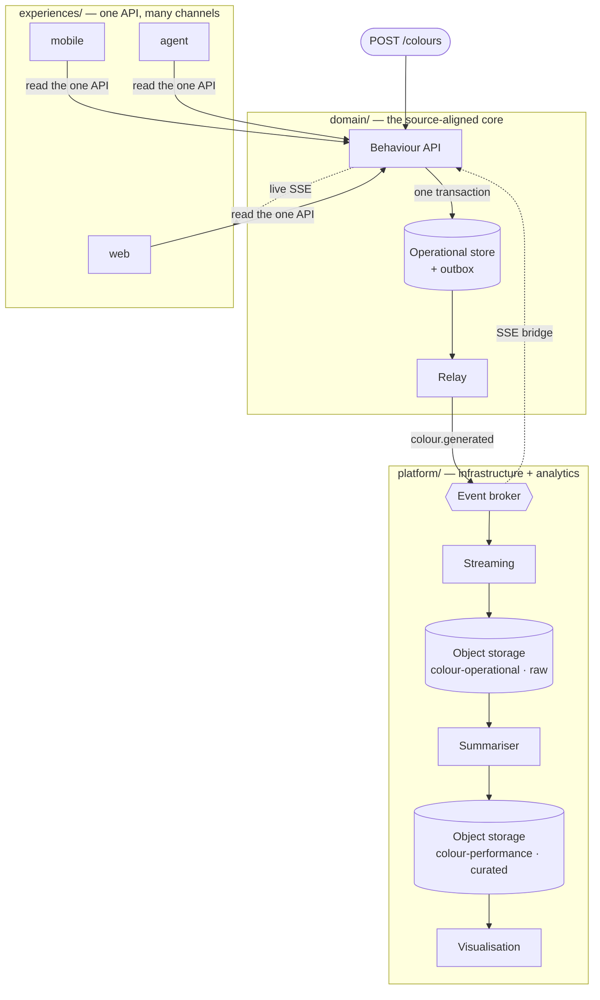
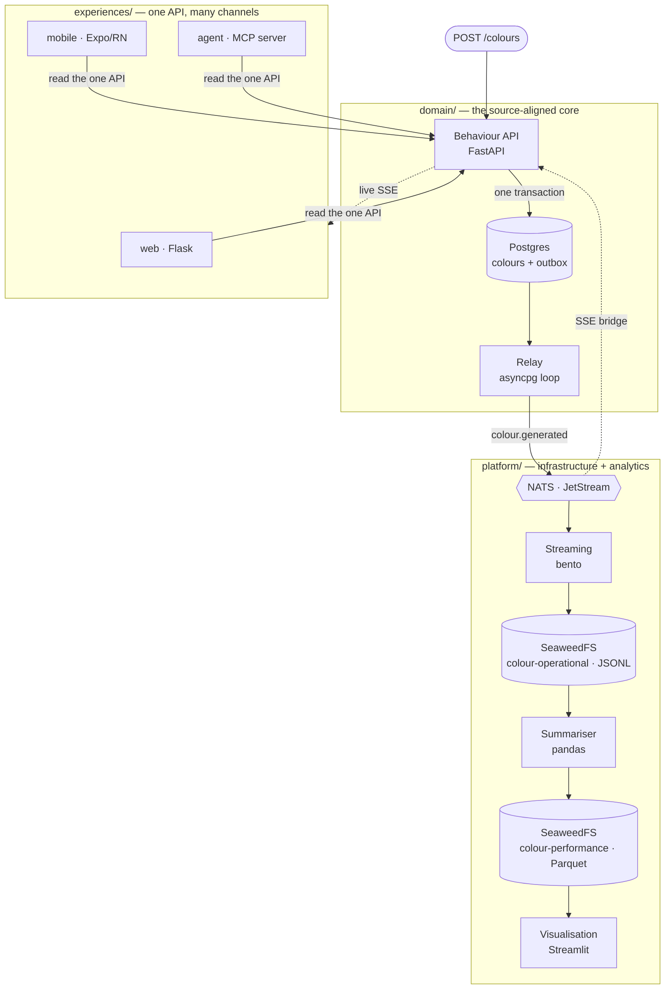

# Architecture

A **source-aligned, API-first, multichannel domain**: one place owns the behaviour, the
operational state, the events, and the contracts; every experience consumes that same
contract instead of reimplementing logic.

## The pattern

The logical shape, independent of any platform — the same diagram appears in every port of this
pattern (only the [implementation](#this-implementation) labels change):



## This implementation

The same pattern, realised with this repo's stack — identical topology, concrete tech in each
box (FastAPI, Postgres, NATS, SeaweedFS, …):



## The three zones

| Zone | Owns | Rule |
| --- | --- | --- |
| `domain/` | The behaviour API, the operational store schema, the outbox relay, **all contracts** (OpenAPI, AsyncAPI, data), the event schema | One owner for behaviour and every contract. Nothing else defines what the domain means. |
| `experiences/` | One directory per channel (web, mobile, agent, …) | Channels consume the one API + event feed. Zero shared code between channels; no domain logic in any of them. |
| `platform/` | Streaming (broker → storage), storage init, analytics (summariser, visualisation) | Infrastructure and analytical consumers. Reads data products, never the operational store. |

- **`domain/`** — `POST /colours` generates a colour and, **in a single Postgres
  transaction**, writes both the operational row and a transactional **outbox** row. The
  **relay** ships the outbox to NATS — no dual-write inside the request. Read endpoints
  (`GET /colours/latest`, `GET /colours`) are served from Postgres; an SSE bridge
  (`GET /events/stream`) gives every experience the same live surface.
- **`experiences/`** — three channels, zero shared code, all consuming the same API + event
  feed: `web` (Flask), `mobile` (Expo/React Native), `agent` (MCP server).
- **`platform/`** — bento streams events to object storage; the **summariser** rolls the raw
  stream up into a curated daily aggregate; analytics read the products back.

**Operational vs analytical, demonstrated (not asserted):** live reads come from the domain
API (Postgres); historical/aggregate reads come from the **data products in SeaweedFS**. The
raw product is append-only JSONL; the curated daily aggregate is columnar Parquet. See
[data products](../data-products/index.md).

## Project layout

```
├── domain/                 # The source-aligned core (owns behaviour + contracts + events)
│   ├── api/                #   FastAPI behaviour service, Postgres-backed (src/ + tests/)
│   ├── relay/              #   Transactional-outbox relay (Postgres outbox -> NATS)
│   ├── contracts/          #   api/ OpenAPI + AsyncAPI; data/ two data-product contracts
│   └── events/             #   Event payload schemas
├── experiences/            # Channels that consume the one domain API
│   ├── web/                #   Flask web frontend
│   ├── mobile/             #   Expo / React Native (web-exported for compose)
│   └── agent/              #   MCP server exposing the domain as agent tools
├── platform/               # Supporting infrastructure and analytics
│   ├── streaming/          #   Benthos (bento) NATS -> object-storage pipeline
│   ├── storage/            #   Object-storage (SeaweedFS) + Postgres init schema
│   └── analytics/          #   summariser/ (Parquet rollup) + visualisation/ (Streamlit) + outcomes/ (pandas)
├── docs/                   # Documentation (this tree)
├── Taskfile.yml            # The one set of commands agents, devs, and CI all run
└── docker-compose.yml      # Local, isolated multi-service stack
```

## Naming rules

- **Role-name infrastructure services** — the compose service says what it *is for*, not the
  product: `events` (not `nats`), `operational-store` (not `postgres`), `object-storage`
  (not `seaweedfs`), `streaming` (not `bento`). Swapping the implementation later doesn't
  ripple through configs.
- **Keep honest implementation names** where they are protocols, standards, or image
  contracts: `nats://`, `postgresql://`, `s3://`, `AWS_*`/`S3_ENDPOINT` (the S3 standard),
  `POSTGRES_*` (the image's contract), the image tags themselves.
- **Purpose-name data products** — name them for the need they serve, not their shape:
  `colour-operational` (operational awareness + long-term detail), `colour-performance`
  (performance over time + current status). Each data contract states its purpose, and the
  analytics UI gives each product its own surface (a tab per product).
- **Config keys are role-generic** — `EVENT_BROKER_URL`, `DATABASE_URL`, `DOMAIN_API_URL`.

## Design methodologies

Contract-first development; conventional commits; test-driven development; event-driven
patterns (CloudEvents over AsyncAPI); application behaviour decoupled from the data product;
data outcomes and reporting living alongside the application; local-first and isolation. Data
contracts conform to the
[datacontract specification](https://github.com/datacontract/datacontract-specification).
Spark-family technologies are intentionally excluded — the analytical side stays on plain
Python + Parquet.
